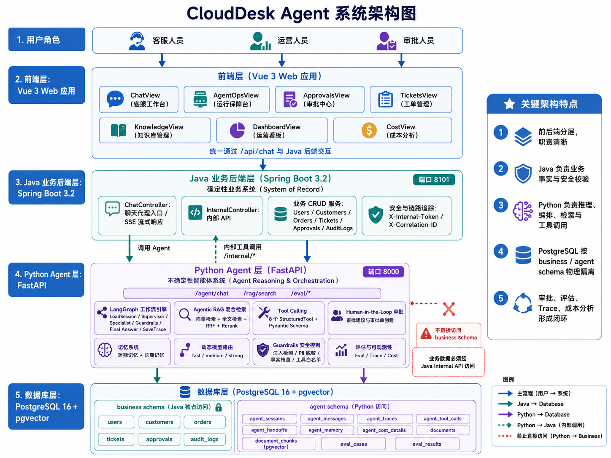
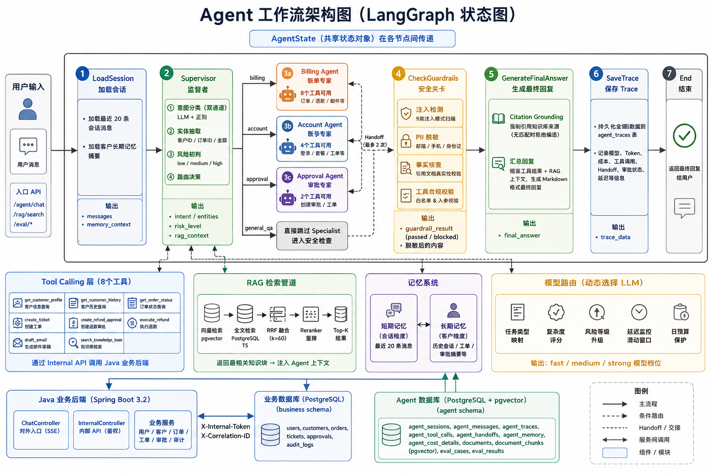

# CloudDesk AgentOps

**基于 LangGraph 的多智能体企业级客服系统** — 一个完整实现 Multi-Agent 协作、Agentic RAG、工具调用、Human-in-the-Loop 审批、全链路安全管控与可观测评估的 AI Agent 项目，面向 SaaS 企业客服场景，覆盖智能体系统的**设计、开发、安全、评估与运维**全生命周期。

---

## 系统架构



系统由四个独立可部署的层级组成：

**前端层** — Vue 3 构建的 7 页管理后台，三栏布局客服工作台直接内嵌 Markdown 渲染、引用标注与 Trace 回溯

**Java 业务后端** — Spring Boot 3.2 管理所有业务事实（用户权限、客户信息、订单状态、工单流程、审批记录、审计日志），作为不可绕过的安全边界

**Python Agent 引擎** — FastAPI + LangGraph 编排 Multi-Agent 工作流，集成了 RAG 检索、工具调用、记忆管理、模型路由、安全护栏、全链路追踪

**数据层** — PostgreSQL 16 + pgvector，分为 business schema（Java 独占访问）和 agent schema（Python 独占访问），物理隔离，Agent 无权直接访问业务数据

---

## Multi-Agent 工作流



4 个专职 Agent 通过 LangGraph 有向有环状态图协作：

| Agent | 角色 | 核心职责 |
|-------|------|---------|
| **Supervisor** | 协调者 / 路由器 | LLM + 正则双通道意图分类、实体抽取（客户/订单 ID）、风险初判、任务路由、最终回复汇总 |
| **Billing Agent** | 账单领域专家 | 订单查询、退款处理、邮件草稿、账单问题解答（8 个工具） |
| **Account Agent** | 账号领域专家 | 登录故障诊断、密码重置、套餐查询（4 个工具） |
| **Approval Agent** | 审批门控 | 根据三级矩阵判断审批级别、创建审批单，**不自行批准**（2 个工具） |

工作流 7 阶段：

1. **LoadSession** — 加载 20 条短期记忆 + 客户长期记忆
2. **Supervisor** — 分类 → 抽取 → 风险评估 → 路由到 Specialist
3. **Specialist** — 领域专家调用工具，完成业务操作（支持最多 2 次 Handoff 交接）
4. **CheckGuardrails** — 注入检测 → PII 脱敏 → 事实核查 → 工具合规校验
5. **GenerateFinalAnswer** — Citation Grounding 引用标注 + Markdown 汇总
6. **SaveTrace** — 全链路持久化到 agent_traces 表

整个工作流通过共享 `AgentState`（TypedDict）传递状态，每个节点可读写，支持条件跳转和循环。

---

## 功能模块

### Agentic RAG

双路并行混合检索，pgvector cosine_distance 向量检索与 PostgreSQL websearch_to_tsquery 全文检索经 Reciprocal Rank Fusion（k=60）融合后由 DashScope GTE-Rerank 语义重排，取 Top-K 注入上下文。文档摄入采用 MarkdownHeaderTextSplitter 按 h1/h2/h3 分层切分。回答阶段强制 Citation Grounding，无匹配文档时拒绝编造。

### 双后端解耦与工具权限

Python Agent 不直接访问业务数据库，8 个 LangChain StructuredTool 通过 `httpx` 调用 Java `/internal/*` API，携带 `X-Internal-Token` 进行服务间鉴权、`X-Correlation-ID` 进行链路追踪。每个 Agent 仅能调用角色白名单内工具，入参经 Pydantic 严格模式校验，越权调用在 Guardrails 阶段被拦截。

### Human-in-the-Loop 审批

三级审批策略矩阵（金额区间 x 风险等级 → 审批级别），高风险操作（close_account / modify_plan / delete_data）强制执行审批。Approval Agent 仅创建审批单，不自行批准，审批最终由 Java 后端权限校验后执行。

### Guardrails 安全防线

四层顺序防线：
1. Prompt Injection 检测 — 匹配 9 种注入模式，命中即阻断
2. PII 脱敏 — 邮箱 / 手机号 / 身份证号正则匹配后替换为 `[已隐藏]`
3. Factual Claim 校验 — 提取回答中引用的文档名，反向查询数据库验证存在性
4. 工具合规校验 — 角色白名单 + Pydantic 严格入参校验

任一防线失败可阻断输出，生成安全兜底回复。

### 动态模型路由

三层模型档位（fast / medium / strong），每次 LLM 调用前综合五因子决策：任务类型映射、风险等级修正、复杂度评分、延迟滑动窗口、日预算保护。每次调用记录模型名、prompt_version、token 消耗与估算成本，成本按 Agent/模型/日期三维度聚合。

### 记忆系统

短期记忆保留最近 20 条会话上下文。长期记忆以客户为维度汇总历史会话、工单与审批记录，在 Supervisor 阶段自动附加到当前上下文。

### Agent 评估

30+ Eval Cases 覆盖 6 类场景，5 项评估指标：意图准确率、检索命中率、工具调用准确率、审批路由准确率、任务成功率。GitHub Actions 在 PR 时自动运行评估回归，4 项质量门控阈值（检索 60%、工具 60%、审批 80%、任务 60%）不通过则 CI 失败。

### 全链路可观测

每次 Agent 执行在 `agent_traces` 表留下完整节点记录（session → supervisor → specialist → guardrails → final_answer），包含意图、实体、模型、prompt 版本、token 消耗、工具调用、Handoff 交接、审批状态、延迟。前端运行保障台提供 Trace 回溯、工具成功率统计、评估对比与成本趋势图表。

### Prompt 版本管理

7 个 Prompt 模板文件独立版本化，`load_prompt()` 从文件加载时返回 `(content, version)`，每次调用在 Trace 中记录所用版本。

---

## 技术栈

| 层级 | 核心技术 |
|------|---------|
| 前端 | Vue 3, TypeScript, Ant Design Vue 4, Pinia, ECharts 6, Vite 7 |
| 业务后端 | Spring Boot 3.2, Java 17, MyBatis-Plus 3.5, Redis, Knife4j |
| Agent 引擎 | Python 3.11+, FastAPI, LangChain 0.3+, LangGraph 0.2+, SQLAlchemy 2.0 |
| LLM | OpenAI Compatible API, 阿里云 DashScope (Embeddings + Reranker), sentence-transformers |
| 数据库 | PostgreSQL 16 + pgvector（向量检索） |
| 测试 | pytest + pytest-asyncio, httpx, Ruff |
| CI/CD | GitHub Actions（Agent 评估回归 + 质量门控） |

---

## 快速开始

### 前置条件

Node.js 20+ / Java 17 + Maven / Python 3.11+ / PostgreSQL 16 并启用 pgvector

### 1. 初始化数据库

```bash
psql -U postgres -c "CREATE DATABASE clouddesk;"
psql -U postgres -d clouddesk -f sql/init.sql
```

### 2. 启动 Agent 引擎

```bash
cd backend-agent
cp .env.example .env
pip install -r requirements.txt
python run.py --dev
```

API 文档：http://localhost:8000/docs

### 3. 启动业务后端

```bash
cd backend
mvn spring-boot:run
```

API 文档：http://localhost:8101/api/doc.html

### 4. 启动前端

```bash
cd frontend
npm install
npm run dev
```

---

## 项目结构

```
CloudDeskAgentOps/
├── frontend/src/views/
│   ├── chat/           客服工作台 — 三栏布局 · Markdown 渲染 · 引用标注 · Trace 回溯
│   ├── agentops/       运行保障台 — Trace 链路 · 评估对比 · 成本趋势
│   ├── approvals/      审批中心 — 待审批列表 · 审批矩阵可视化
│   ├── tickets/        工单管理 — 多条件筛选 · 状态流转
│   ├── knowledge/      知识库 — 文档上传 · Markdown 预览 · 重新索引
│   └── dashboard/      运营看板 — 工单统计 · 审批概览 · 7 日趋势 (ECharts)
│
├── backend/src/main/java/com/springboot/
│   ├── controller/ChatController.java      聊天入口 · SSE 流式转发
│   ├── controller/InternalController.java  内部 API · Token 鉴权 · 业务数据 CRUD
│   └── config/                             安全 · CORS · Redis 配置
│
├── backend-agent/app/
│   ├── agents/            Supervisor · Billing · Account · Approval (4 Agent)
│   ├── workflow/graph.py  LangGraph 状态图编排 (600+ 行)
│   ├── rag/               Embeddings · 关键词检索 · RRF 融合 · Reranker · 文档摄入
│   ├── tools/              8 个 LangChain StructuredTool · 白名单 · Pydantic 校验
│   ├── guardrails/         注入检测 (9 种) · PII 脱敏 · 事实核查 · 工具策略 · 审批矩阵
│   ├── memory/             短期记忆 (20 条) · 长期记忆 (客户维度摘要)
│   ├── routing/            三档模型路由 · 五因子决策 · 预算保护 · 延迟降级
│   ├── observability/      Trace 记录 · 成本追踪 · 按 Agent/模型/日期聚合
│   ├── evals/              评估执行器 · 5 项指标 · 场景分类统计
│   ├── db/                 SQLAlchemy 模型 (agent schema · 12 张表含 pgvector)
│   ├── prompts/            7 个版本化 Prompt 模板
│   └── core/               配置 · 中间件 · 异常处理
│
├── sql/init.sql           完整建表 + 种子数据 (business + agent schema)
└── .github/workflows/eval.yml  CI 自动评估回归 · 质量门控
```
